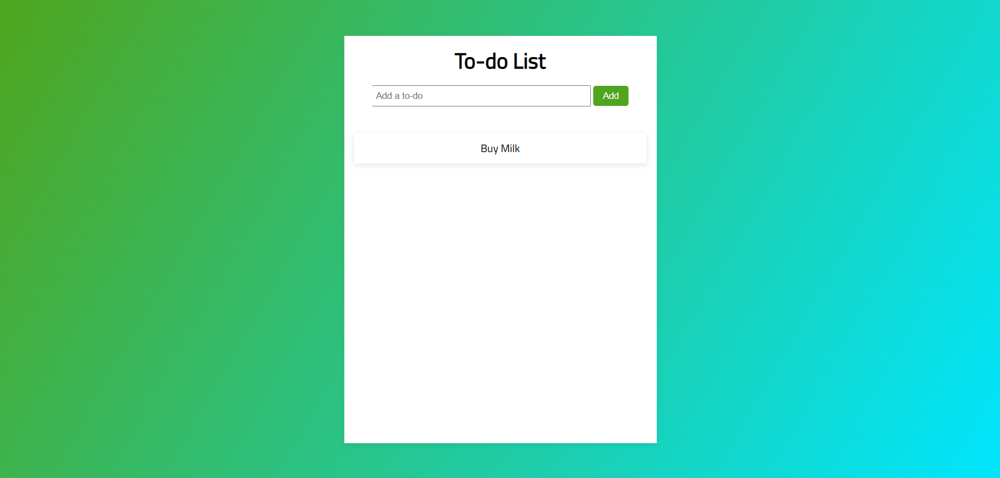
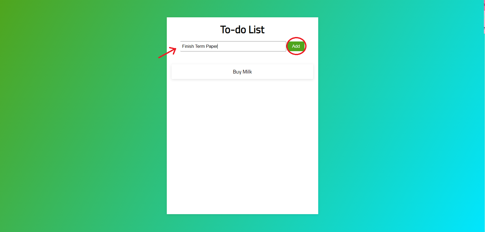

# To Do App

A simple to-do app built using Javascript. My attempt at creating functionality and icons. No back-end support.

###### Project Date: July 2021

## Walkthrough

### 1. View list

### 2. Add item to list

